### What is Karyotype Evolution?

Karyotype comprises both chromosome numbers and character of each chromosome for one species. Karyotype evolution represents chromosomal changes from the ancestral genome to the modern genome. This information is critical for reconstructing ancestral karyotypes and tracing how modern species evolved step by step. The evolution of ancestral karyotypes, especially involving changes in the number of chromosomes, usually results in speciation with rapid reproductive isolation. However, in the long evolutionary history of the karyotype of one current species, ancestral chromosomes fusion or fission gradually and randomly in the offspring lineages. This means that each intact ancestral chromosome (protochromosome) could be retained across the highly diverged lineages. In addition, the lineage closer to the common ancestor with fewer genome changes (for example, whole-genome duplication, WGD) may retain more protochromosomes than those distantly related ones with more WGD. If one protochromosome fused with another to produce one new chromosome or fissioned into two new chromosomes, the syntenic blocks could be identified as a basic rule. The other basic rule for such an ancestral karyotype should be that all protochromosomes or their syntenic blocks correspond completely to all chromosomes of each offspring species.

### The method to identify ancestral karyotypes

The previous approaches for karyotype reconstruction define contiguous ancestral regions (CARs) based on collinearity. However, due to chromosome structural abnormalities and short syntenic blocks, undefined regions become gap regions and the final result is highly dependent on the input files and parameters. In addition, a large number of gap regions in the results cannot continue to explore chromosomal changes. Different from these previous methods, we identify the protochromosomes by searching the shared intact chromosomes or chromosome-like syntenic blocks during chromosomal fusions across the highly diverged lineages. During chromosomal fusions, chromosome-like syntenic blocks are retained, in which chromosomes are protected by telomeres, and the fused chromosomes, therefore, have telomeres. However, it should be noted that our method did not exclude the chromosomal fissions, in which one protochromosome produced two chromosomes. Under this scenario, we can identify this protochromosome in other lineages, which may be intactly retained or fused with other protochromosomes. We summarize karyotypic changes during three basic chromosomal fusion types and also processes that we used to identify protochromosomes for ancestral angiosperm karyotype.

###### Karyotype evolution model and uniqueness of chromosomal fusions

Three basic chromosomal fusions comprise reciprocally translocated chromosome arms (RTA), end-end joining (EEJ) and nested chromosome fusion (NCF) (Fig.1). Chromosome translocations include reciprocal translocation and Robertsonian translocation, which correspond to RTA and EEJ, respectively. The NCF pattern is also widely recognized and used (Celebrating Mendel, McClintock, and Darlington: On end-to-end chromosome fusions and nested chromosome fusions. The Plant Cell. doi: 10.1093/plcell/koac116, 2022).

[^Figure 1]:  Three basic chromosomal fusion

Although chromosomal structural variations occur frequently in genomes, the probability seems to be very low that the positions of protochromosome fusion happen to overlap with the breakpoints of further structural variations at the later evolutionary stage. Therefore, such fusion positions could be accurate to infer whether two lineages share the same ancestor or not. Similarly, the inversion often occurs during chromosomal evolution, it is nearly impossible to disrupt the positions of protochromosome fusion. So, inversions have little effect on karyotype reconstruction.

Chromosomal fission usually refers to when one protochromosome breaks into two or more independent chromosomes. The RTA defined above comprises special chromosomal fission. Other chromosomal fission was not considered here because of two reasons. First, WGD is common in plants and chromosomal fusions occur more frequently after WGD. Second, if protochromosomal fission occurs in one lineage, for example, breaking into chromosomes, the identification of this protochromosome could be replaced by other lineages in which it may have remained intact or fused with other protochromosome with chromosome-like syntenic blocks. In addition, two fissioned chromosomes also correspond to syntenic blocks, which could be identified and deleted during the second cycle of the protochromosome identification.

###### Basic steps for construction of ancestral chromosome karyotype and karyotypic evolution

Four steps were undertaken to construct the ancestral karyotype(Fig.2a-b). First, identifying chromosome-like ‘synteny blocks’ and small synteny blocks across all sampled genomes. Second, exploring the shared ‘synteny block’ with telomeres (chromosome-like) and the intact chromosome across extant genomes and extracting the most intact of these (for example, one chromosome) as one protochromosome. Third, deleting this shared block and its syntenic small blocks across all extant genomes and connecting the remaining parts together as ‘entire chromosomes’. Fourth, starting one more round of ‘synteny exploration’ to extract all protochromosomes until no genomic block was left for each extant genome.

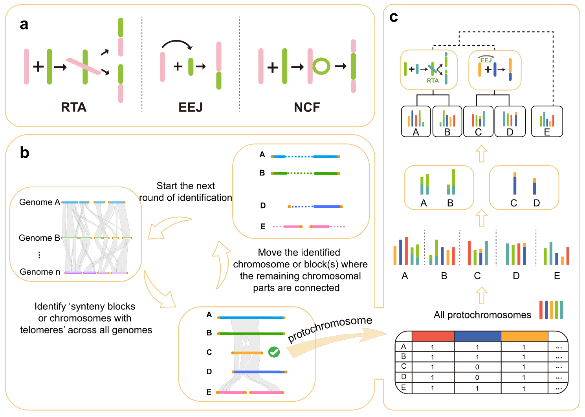

[^Figure 2]: According to the three basic chromosomal fusion types (a), one outlined identification of protochromosomes based on the shared chromosomes or chromosome-like syntenic blocks across the highly diverged lineages (b) and determination of the phylogenetic relationships and karyotypic evolution for the common ancestor (c).

All protochromosomes of the ancestral karyotype are compared with each extant genome and the karyotypic composition from the protochromosomes is determined. According to fusion and fission positions between protochromosomes of the ancestral karyotype and chromosomes of the current species, the karyotypic changes and phylogenetic relationships are inferred (Fig. 2c).

### Karyotype reconstruction demonstration

###### **Ancestral eudicots karyotypes (AEK) as an example**

The chromosome number and gene repertoire of AEK are almost undisputed, and we use our method as an example to show the detailed process of AEK. We reconstructed the AEK with *Tetracentron sinense* which is one of four early diverging lineages of eudicots. We first used WGDI with the "-d" parameter to plot the dotplot within *T. sinense*. Polyploidy analysis showed that *T. sinense* has two WGD (whole Genome Duplication) events, which means that *T. sinense* has four copies of AEK.

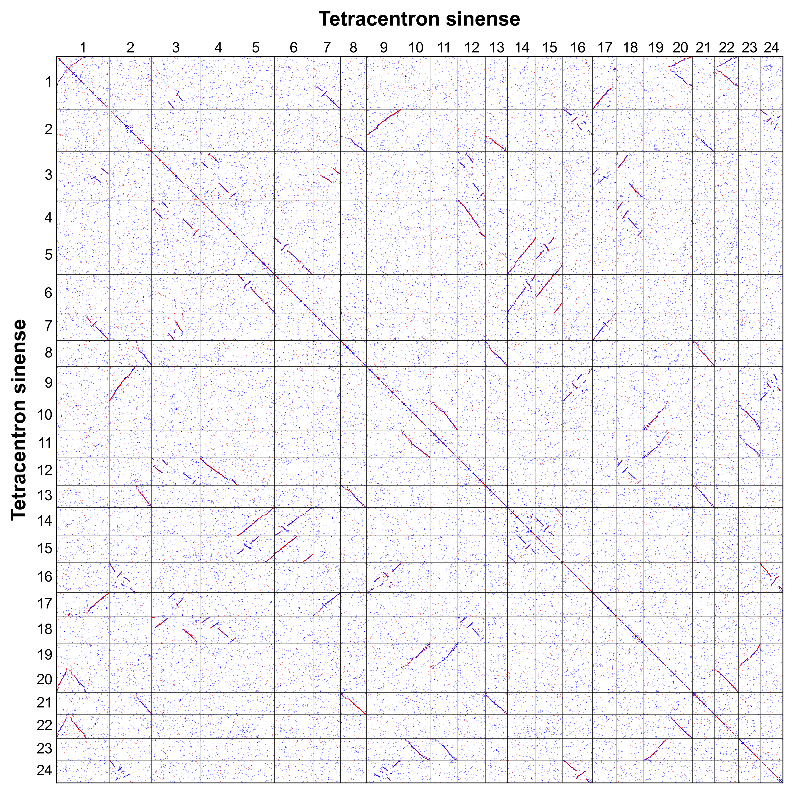

Then, We adjusted the order of chromosomes in the lens file (required by [WGDI](https://github.com/SunPengChuan/wgdi)) several times and plot the homologous dotplot to keep the dotplot collinear blocks together as much as possible. 

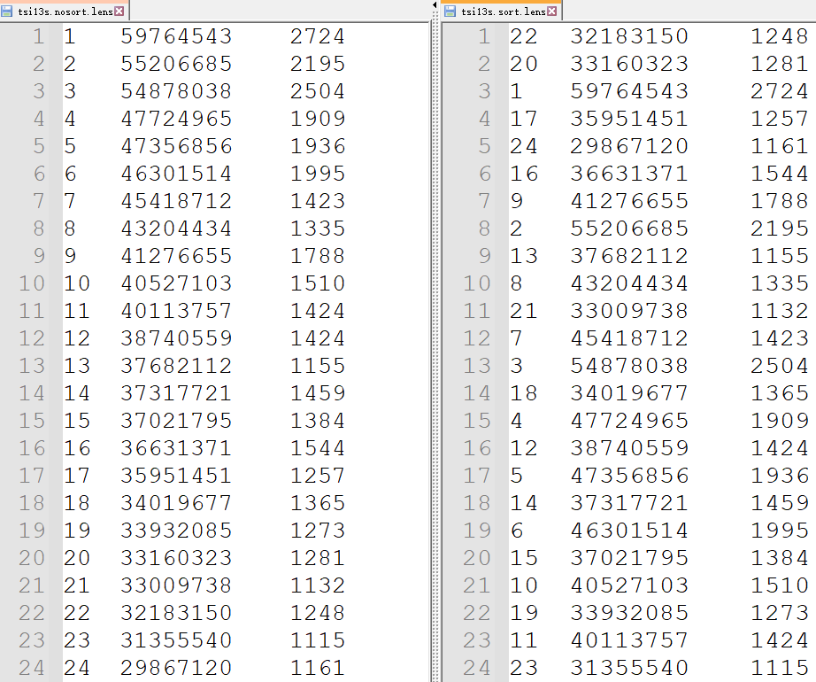

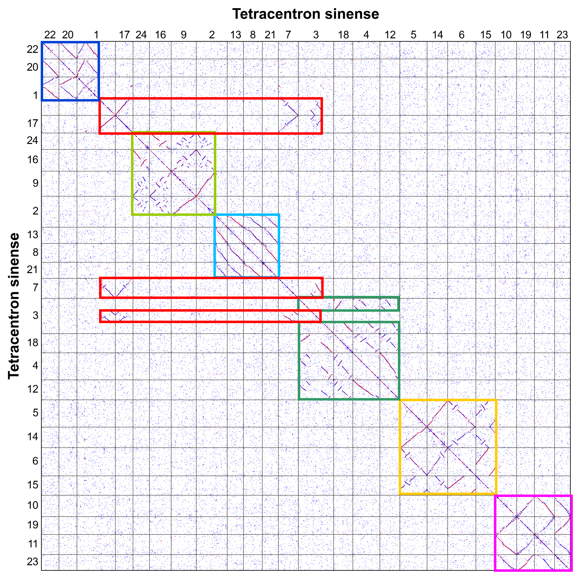

We separately extracted haplotypes with whole chromosomes as protochromosomes from different clusters. Such as Chrs 22 and 20 in the blue cluster, Chrs 17 and 7 in the red cluster, Chrs 24,16 and 9 in the grass green cluster, Chrs 13，8 and 21 in the blue cluster, Chrs 18, 4 and 12 in the green cluster, Chrs 5, 14, 6 and 15 in the orange cluster and Chrs 10,19,11 and 23 in the blue cluster. We select a protochromosome from each cluster and mark them with different colors and groups. Here the result file is as follows.

|  22  |  1   | 1248 |  RoyalBlue  |  1   |
| :--: | :--: | :--: | :---------: | :--: |
|  17  |  1   | 1257 |     red     |  1   |
|  24  |  1   | 1161 |   #99CC00   |  1   |
|  13  |  1   | 1155 | deepskyblue |  1   |
|  18  |  1   | 1165 |   #339966   |  1   |
|  5   |  1   | 1936 |   #FFCC00   |  1   |
|  10  |  1   | 1510 |   fuchsia   |  1   |

Then, We used WGDI with the "-ak" parameter to get the AEK inferred by *T. sinense*. 

> The AEK are available in /Karyotype_Evolution_Example/ancestor/AEK. 

The ancestor file of AEK is as follows.

|  1   |  1   | 1248 |  RoyalBlue  |  1   |
| :--: | :--: | :--: | :---------: | :--: |
|  2   |  1   | 1257 |     red     |  1   |
|  3   |  1   | 1161 |   #99CC00   |  1   |
|  4   |  1   | 1155 | deepskyblue |  1   |
|  5   |  1   | 1165 |   #339966   |  1   |
|  6   |  1   | 1936 |   #FFCC00   |  1   |
|  7   |  1   | 1510 |   fuchsia   |  1   |

Most of the genes of *T. sinense* should be derived from AEK, we further mapped AEK to *T. sinense* to prevent other protochromosomes from being ignored. We first used WGDI with the "-d" parameter to plot homologous dotplot between *T. sinense* with AEK. 

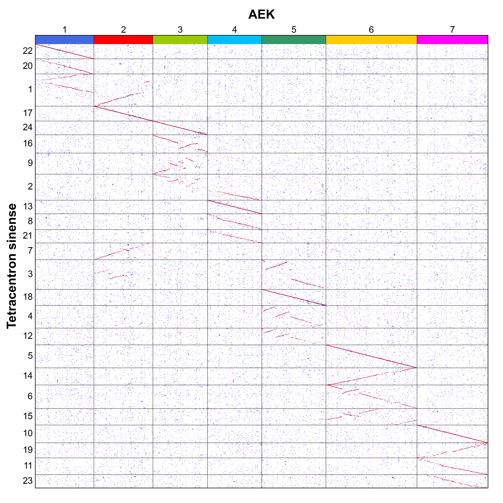

Then, we used WGDI with the "-icl" parameter to find collinear genes between them. Then, we used WGDI with the "-bi" parameter to find collinear genes between them. Then, we used WGDI with the "-bi" parameter to integrate collinear blocks for easy screening of collinear fragments. Then, we used WGDI with the "-c" parameter to filter out blocks that may be from more ancient events. We also used WGDI with the "-bk" parameter to check the remaining blocks are reasonable.

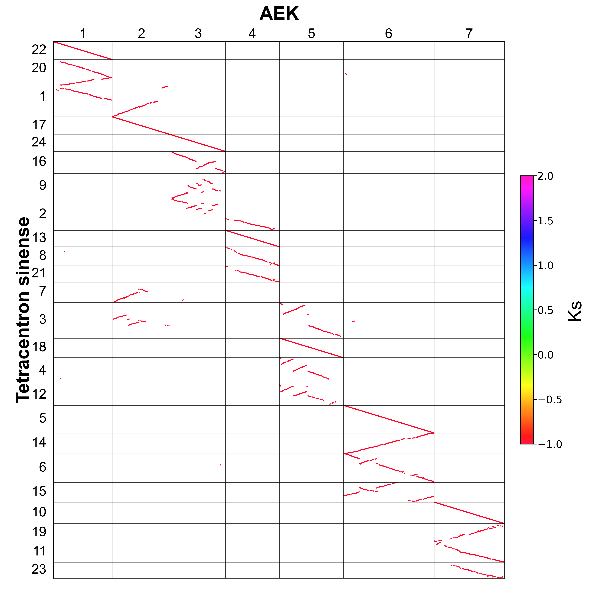

Then, We also used WGDI with the "-km" parameter to obtain the mapping of AEK. Finally, We again used WGDI with the "-d" parameter and added the ancestor_left to plot the homologous dotplot. 

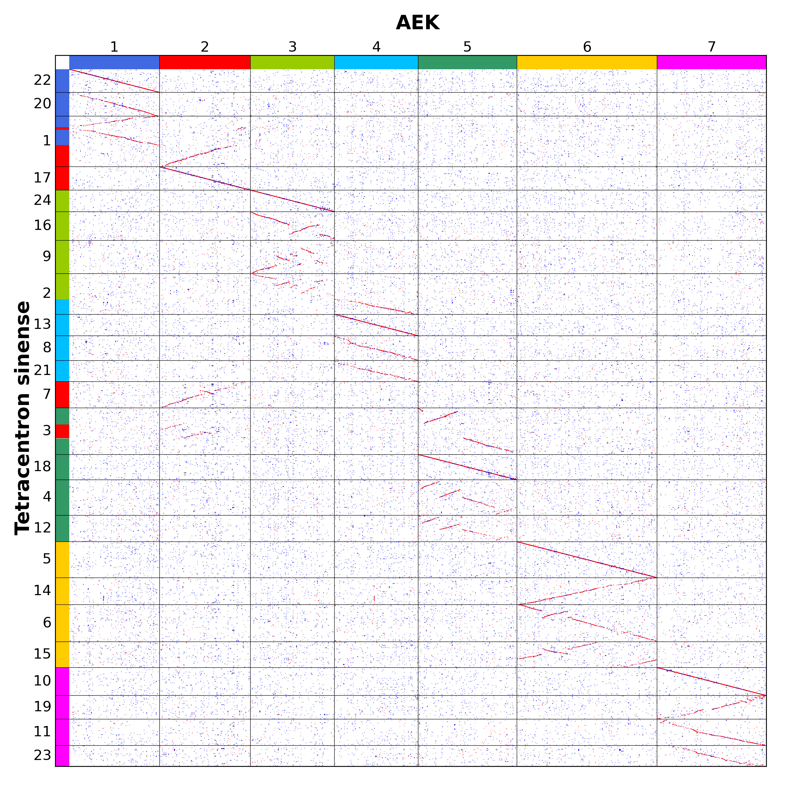

We can see that most of the genes of T. sinense are in the collinear block with AEK. At the same time, Chr1 of T. sinense can be formed by the insertion of AEK1 into AEK2 through the NCF model and then fused with another AEK1 again through the EEJ model, and this process reduces two ancestral chromosomes. Chr1 of T. sinense can be formed by the fusion of AEK3 and AEK4 through the EEJ model, and this process reduces one ancestral chromosome. Chr3 of T. sinense can be formed by the insertion of AEK2 into AEK5 through the NCF model, and this process reduces one ancestral chromosome. T. sinense should have 4*7=28 chromosomes in theory after two WGDs from AEK, It currently has 24 chromosomes after reducing 2+1+1=4. There is no duplication of fused chromosomes, and it can also be inferred that no chromosomal fusion event occurred before the recent WGD of T. sinense. The karyotype evolution of T. sinense can be explained by our model, which again demonstrates the reliability of our model.

This AEK result does not represent the ancestral karyotype for all eudicots and requires further validation in other species. We used *V. vinifera* to validate this AEK result. As in the previous process, We used WGDI with the "-d, -icl, -bi,-c, -km, -d" parameters for comparison.

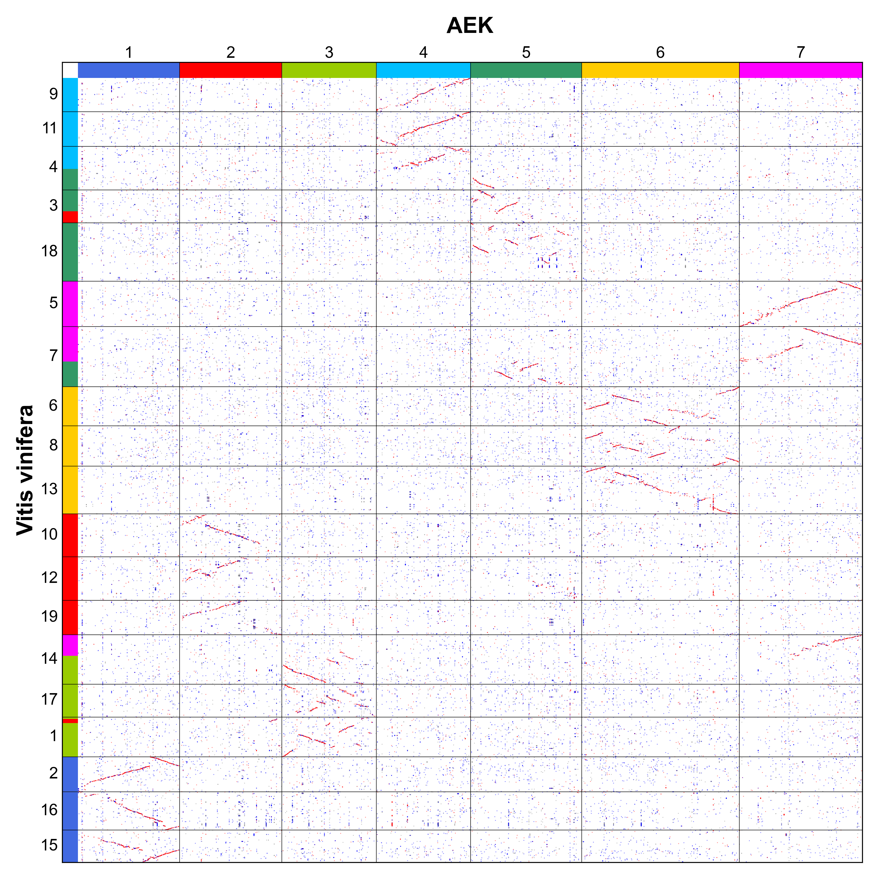

Polyploidy analysis showed that *V. vinifera* has  WGT (whole Genome  Triplication) events, which means that *v. vinifera* has three copies of AEK. For each protochromosome of AEK, intact homologous chromosomes can be found in *v. vinifera*, and no chromosome is the proper subset of protochromosomes. So, this AEK with 7 protochromosomes can represent the ancestral karyotype for all eudicots.

> The comparison is available in /Karyotype_Evolution_Example/dotplot/vvi161s_aek_tsi13s.

The selected species is important for karyotype reconstruction. Some species have stable chromosomes, and most chromosomes are protochromosomes. For example, *Buxus sinica* has 14 chromosomes and it has an independent WGD event. Its chromosomes are directly retained from AEK after one WGD. we plotted the homologous dotplot between AEK and *B. sinica*. The AEK inferred by *T. sinense* is consistent with that of *B. sinica*, indicating the result of karyotype reconstruction is unique.

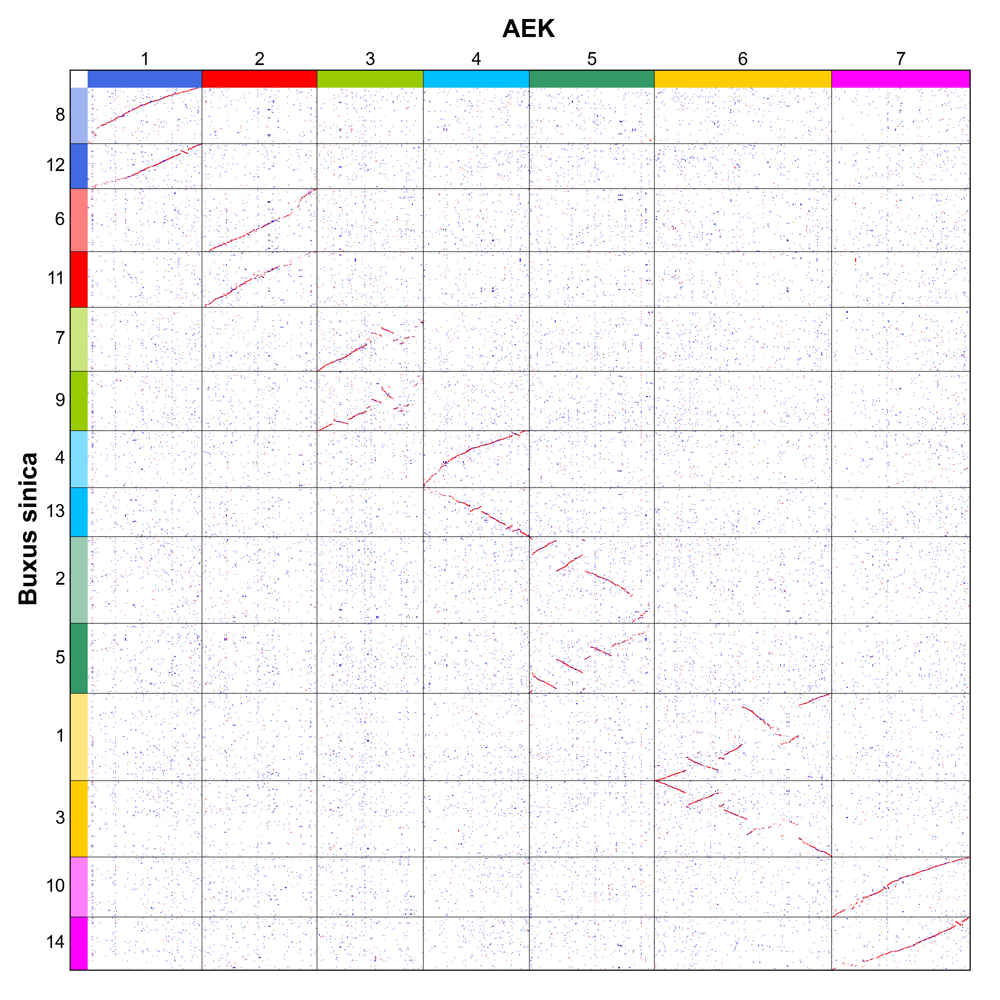

###### **Ancestral core eudicots karyotypes (ACEK) as an example**

ACEK should have 3*7=21 protochromosomes after WGT from AEK. To determine whether these 21 protochromosomes have shared chromosomal fusions during evolution, we added here Cercidiphyllum japonicum except *V. vinifera*. Using the previous process, we can easily get the karyotype of AEK's prochromosomes on *C. japonicum*. 

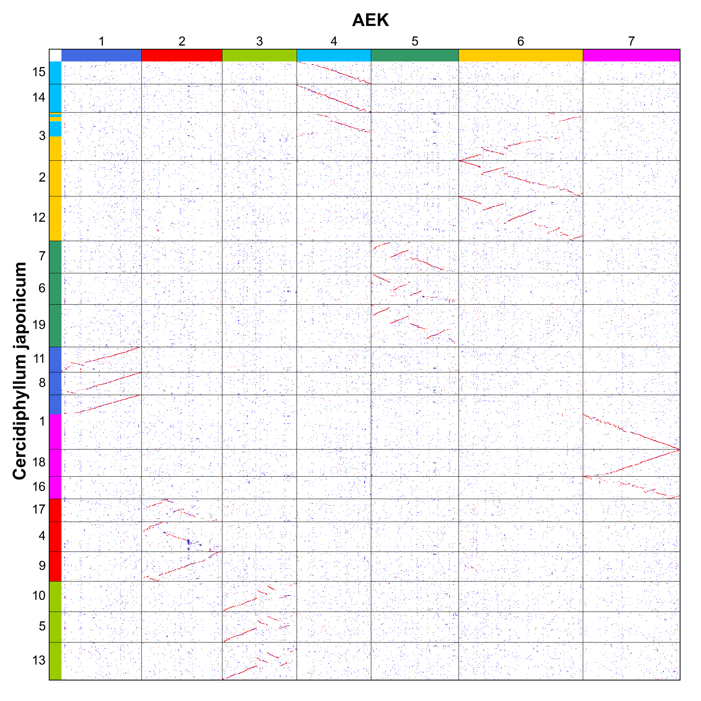

We then used WGDI with the "-d" parameter to plot homologous dotplot between *C. japonicum* (Cja) with *V. vinifera* (Vvi). The red dots in dotplot represent that homologous gene pairs are the best hits, and the collinear blocks connected by these red dots means that they are paralogs blocks retained by species divergence. A paralogous block is from the same protochromosome with the same color, however, there are four color mismatches (red circles) in this dotplot.

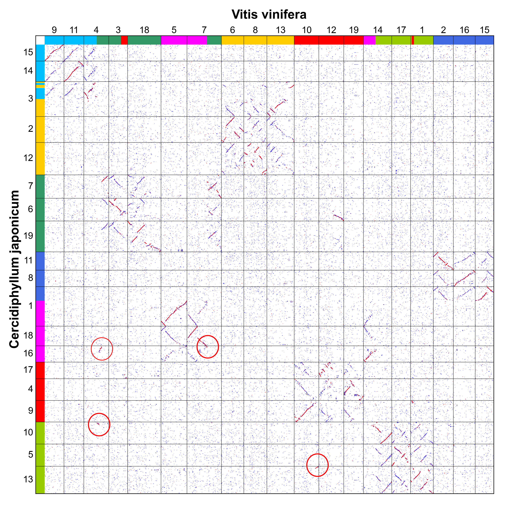

This is due to the lack of high-quality collinear fragments between some small fragments of structural variation and AEK. For these cases, we selected the chromosome without structural variation as the protochromosome of ACEK. For example, we chose Cja8, Cja11 and Vvi15 for AEK1 because the blue bar of Cja1 corresponds to Vvi15 and Vvi15 is an intact chromosome. We chose Cja17, Cja4 and Cja9 for AEK2 because of the scattered distribution of red bars on *V. vinifera*. We chose Cja10, Cja5 and Cja13 for AEK3 because of the scattered distribution of grass green bars on *V. vinifera*. We chose Cja15, Cja14 and the blue bar of Vvi4 for AEK4 because of the discontinuous distribution of red bars on *C. japonicum*. We chose Cja7, Cja6 and Cja19 for AEK5 because of the scattered distribution of green bars on *V. vinifera*. We chose Vvi6, Vvi8 and Vvi13 for AEK6 because of the discontinuous distribution of orange bars on *C. japonicum*. We chose Vvi5, Cja18 and Cja16 for AEK7 because the purple bar of Cja1 corresponds to Vvi5 and Vvi5 is an intact chromosome. There are no shared fusion events in this process, so the number of ACEK before divergence is 21.

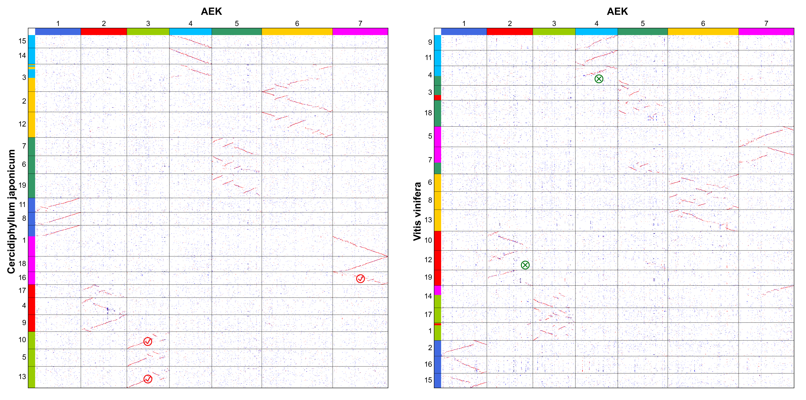

​	Then, We grouped the three copies of AEK into different subgenomes and used WGDI with the "-ak" parameter to get the ACEK inferred by *C. japonicum* and *V. vinifera*. As in the previous process, we use WGDI with "-d, -icl, -bi, -c, -km, -d" parameters to compare *C. japonicum* , *V. vinifera* with ACEK. It should be noted that we need to select paralogs blocks for mapping. Therefore, we need to confirm that the input csv file of the '-km' parameter does not contain other blocks through the '-bk' parameter.

​	Finally, we mapped the ACEK to *C. japonicum and *V. vinifera*. For *C. japonicum*, it has undergone two fusions since ACEK, the insertion of ACEK18 into ACEK20 through the NCF model and the fusion of ACEK1+7 through the EEJ model.

> The ACEK are available in /Karyotype_Evolution_Example/ancestor/ACEK. 

​	As for V. vinifera, to easily examination of ancestral chromosomal changes, we re-plotted the dotplot using these chromosomes involving chromosomal rearrangements. Vvi3+12 is exactly equal to ACEK5+2, which phenomenon is consistent with our model of reciprocally translocated chromosome arms (RTA). If it is assumed that two chromosomes are first fission and then fusion, the four ``chromosomes`` after fission are more likely to fusion with other chromosomes with more numbers. Therefore, it is more reasonable to use the RTA model here. ACEK9 and ACEK17 were fused into two chromosomes (Vvi10 and Vvi1) through the RTA model. ACEK21 and ACEK3 were fused into one chromosome (Vvi14) and a very small chromosome (middle part of Vvi4 ) through the RTA model. This small chromosome and ACEK12 were further fused into two chromosomes ( part of Vvi4 and part of Vvi7 ) through the RTA model. These two chromosomes were later fused with ACEK18 and ACEK14 into Vvi4 and Vvi7, respectively. The chromosome evolution process of *V. vinifera* is relatively complex, especially the change between ACEK21, ACEK3 and ACEK12, which makes it easy to doubt its reliability. It is an honor that another subgenus of *Vitis* has given us strong confidence.

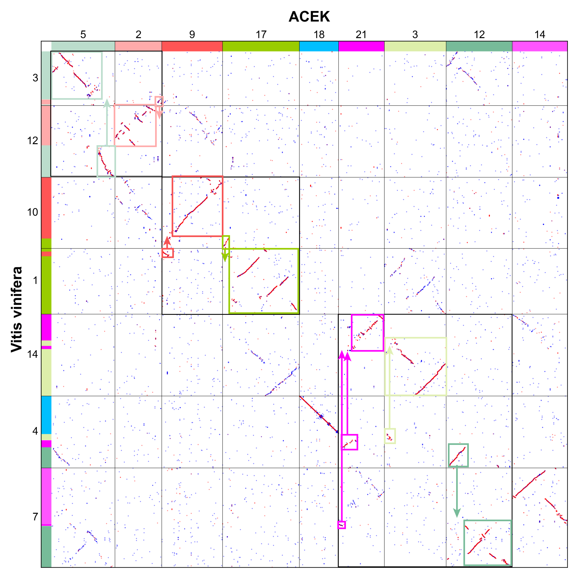

###### The dynamic history of two subgenus of *Vitis*

*Vitis* is divided into Muscadinia Planch (2n=40) and Euvitis Planch (2n=38). *Muscadinia rotundifolia* belongs to the subgenus Muscadinia Planchand
 *V. vinifera* belongs to the subgenus Euvitis Planch. We obtained the mapping of ACEK for *M. rotundifolia* in the same way. 

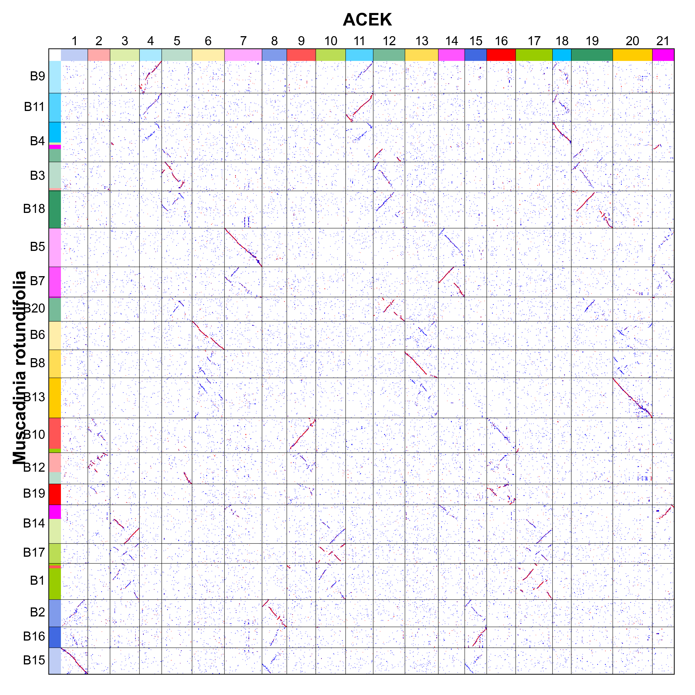

Comparing *V. vinifera* and *M. rotundifolia*, most ancestral chromosomal fusions were found to be shared in *Vitis*. The only difference is MroB7 and MroB20 and Vvi7. If MroB7 and MroB20 are formed by the fission of Vvi7, it is very coincidental that the partial fission happens to be an intact chromosome B7 (ACEK14), with a low probability. Conversely, it is much easier to fuse MroB7 and MroB20 into Vvi7. Meanwhile, MroB14 did not undergo inversion from ACEK. These all suggest that Muscadinia Planch may be closer to the ancestral karyotype of *Vitis*.

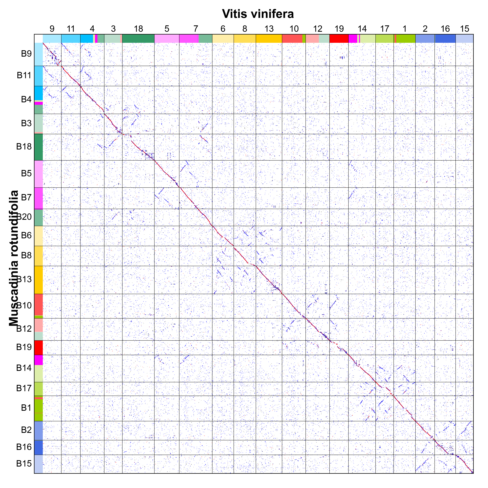

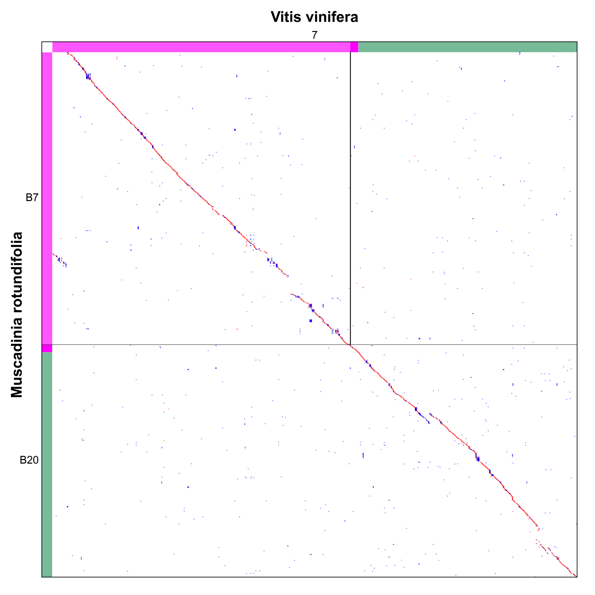

In summary, the dynamic evolution process of the ancestral karyotype of *Vitis* from ACEK is as follows.

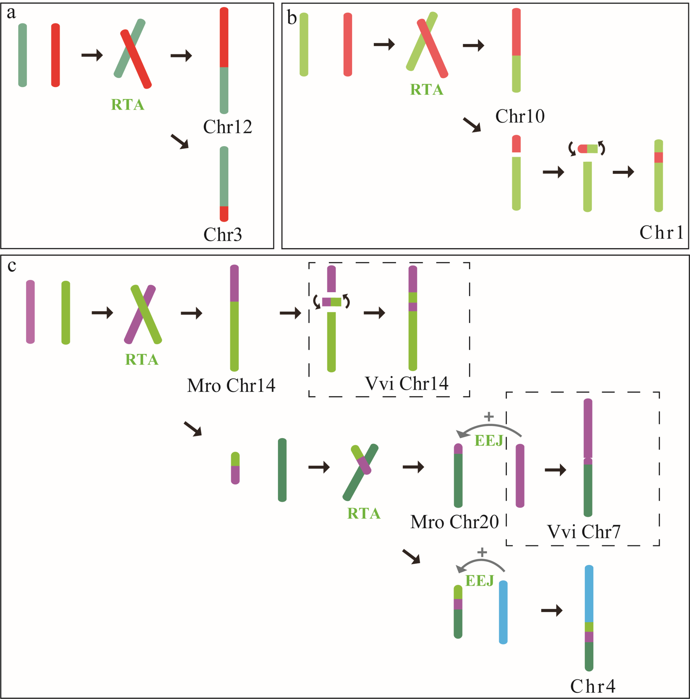

Our karyotype evolution models can clearly explain the karyotype evolution of these four species, especially the dynamic history of two subgenera of Vitis. This gives us confidence that it likely applies to all angiosperms as well.

### What can Karyotype Evolution be used for?

(1) Paleogenomics and exploring the evolutionary trajectories of species
(2) Phylogenetic and Species Taxonomy
(3) Verify genome assembly
(4) Detection of autopolyploidy or allopolyploidy