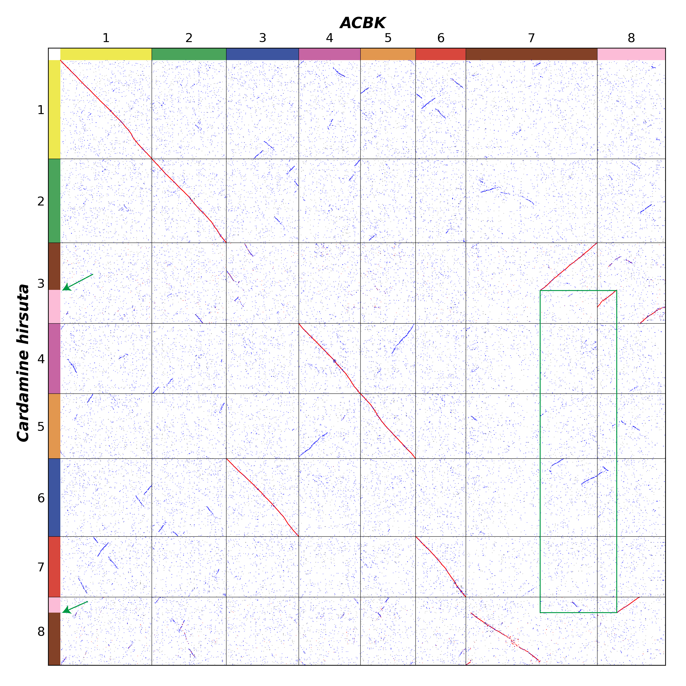
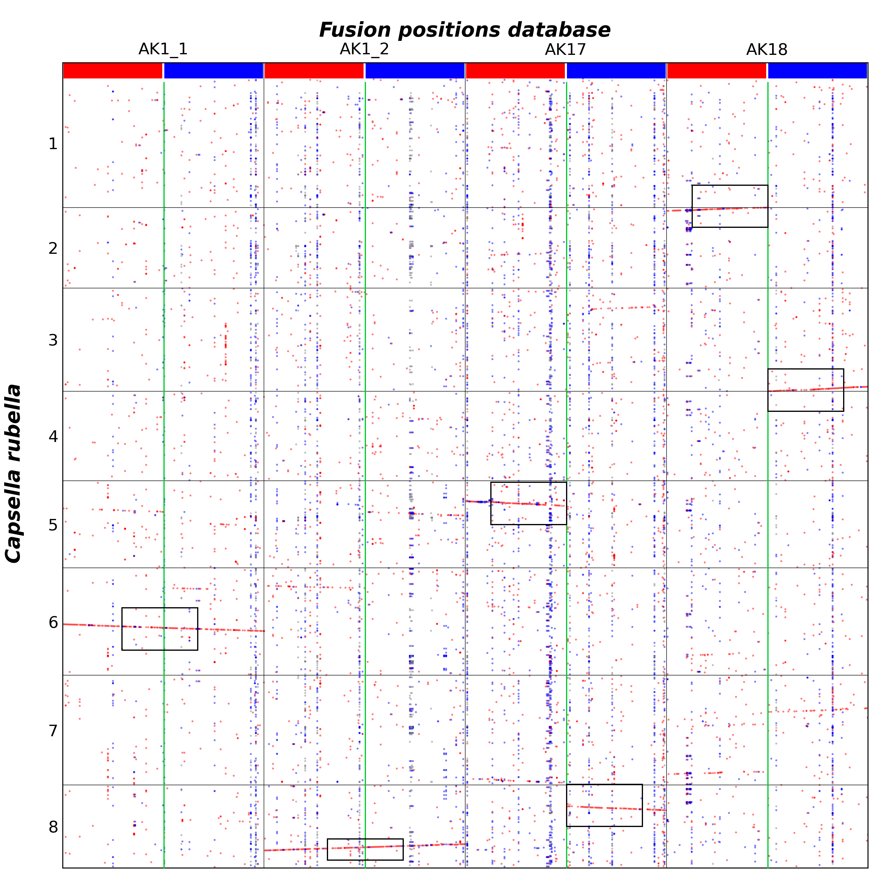
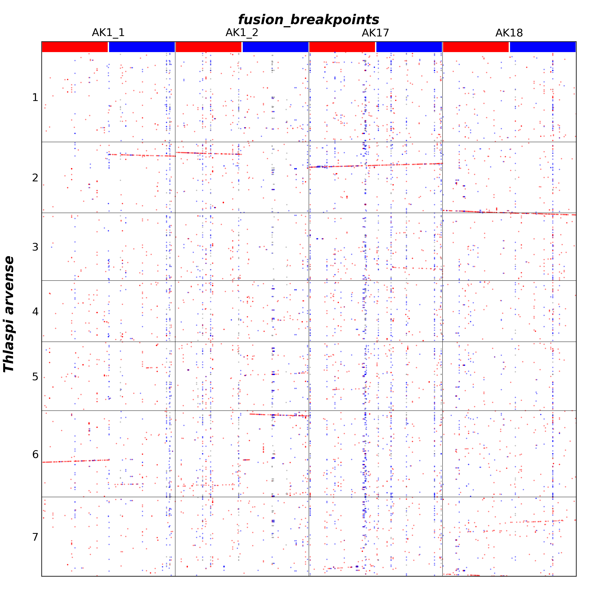

### Shared Fusion Positions

Let's take an ancestral karyotype as an example to explain in detail how to construct a fusion positions database and test for shared positions across different species.

---

#### Identifying Fusion breakpositions and Generating the Database
We begin by using the WGDI toolkit (Sun et al., 2022) with the parameter `-d` to generate a homologous gene dotplot between *Cardamine hirsuta* and the ancestral karyotype (ACBK). By employing the WGDI parameter `-km`, we mapped the protochromosomes of the ancestral karyotype onto the query genome based on collinearity, resulting in the ancestor file, [Chi2.ancestor.txt](./Shared_fusion_positions/Chi2.ancestor.txt).

From the dotplot, we observe a reciprocal chromosome translocation involving chromosomes ACBK7 and ACBK8 (denoted ACBK/7_8/RCT). Reading the file [Chi2.ancestor.txt](./Shared_fusion_positions/Chi2.ancestor.txt) reveals the fusion breakpoints at Chr3:1948 and Chr8:653.

This information is then recorded in a document, as detailed in the **Fusion Positions File** section of the [WGDI documentation](https://wgdi.readthedocs.io/en/master/usage.html). An example of such a file is [Chi2.txt](./Shared_fusion_positions/Chi2.txt). By executing the WGDI command with the parameter `-fpd` (e.g., `wgdi -fpd Chi2.conf`), the corresponding fusion positions database is generated. This process generates the outputs, including the essential files `.gff`, `.lens`, `.pep`, and the ancestor file (e.g., [fusion_breakpoints.ancestor.txt](./Shared_fusion_positions/fusion_breakpoints.ancestor.txt)). For more details and additional files,such as [Chi2.conf](./Shared_fusion_positions/Chi2.conf), please refer to the [Shared_fusion_positions/](./Shared_fusion_positions/) directory.

For cases with multiple fusion breakpoints from different species, ensure that the output file remains consistent and that the last column of each input record (e.g., [Chi2.txt](./Shared_fusion_positions/Chi2.txt)) has unique markers. Repeatedly executing `wgdi -fpd *.conf` will append additional fusion positions to the same output. 

---

#### Testing for Shared Fusion Positions in Additional Species

To test whether the identified fusion positions are shared in other species, compare their genomes against the generated fusion positions database using the WGDI parameters `-d`, `-icl`, `-bi`, and `-fd`. 

Note that the fusion positions database may involve regions that are extracted multiple times. Therefore, collinearity extraction should be performed through interchromosomal comparisons. When running the `-icl` parameter, set `comparison = chromosomes` and adjust `repeat_number` to a smaller value, such as `repeat_number = 5`.

The criterion for determining shared fusion positions is that a synteny block spans the fusion breakpoint. Specifically, both sides of the breakpoint must contain collinear genes, controlled by the parameter `min_genes_per_side`.

The final output from `-fd` will list shared fusion breakpoints. For example, we used *Capsella rubella* for testing, and the output from the `-fd` parameter was as follows:

The following are the shared fusion breakpoints:
AK1_1, AK1_2

This output indicates that *Capsella rubella* possesses these two shared fusion breakpoints: AK1_1 and AK1_2. If no such output is generated, it implies that these fusion breakpoints are not present in the tested species.

The following are the shared fusion breakpoints:
AK17

This output indicates that *Thlaspi arvense* possesses these two shared fusion breakpoints: AK17.