### Subgenome-aware analyses

Let’s delve into a detailed explanation of how we can phase subgenomes corresponding to the balsa tree, cotton, heritiera littoralis, and durian using the Chr3 of cacao as an example.

###### Phased subgenomes for the balsa tree. 

We start by using the WGDI toolkit (Sun et al. 2022) with the parameter '-d' to plot a homologous gene dot plot between the balsa tree and cacao. The parameter ‘ancestor_top = tc180s.ancestor.txt’. Only the Chr3 of cacao is colored; all other chromosomes are white. The resulting dot plot is shown in the figure below.

[tc180s.ancestor.txt](./phase_subgenomes/figure/tc180s.ancestor.txt)
| 1    | 1    | 3130 | white   | 1    |
| :--- | :--- | :--- | :------ | :--- |
| 2    | 1    | 2675 | white   | 1    |
| 3    | 1    | 2367 | #ff9900 | 1    |
| 4    | 1    | 2285 | white   | 1    |
| 5    | 1    | 2366 | white   | 1    |
| 6    | 1    | 1751 | white   | 1    |
| 7    | 1    | 1253 | white   | 1    |
| 8    | 1    | 1496 | white   | 1    |
| 9    | 1    | 2718 | white   | 1    |
| 10   | 1    | 1224 | white   | 1    |

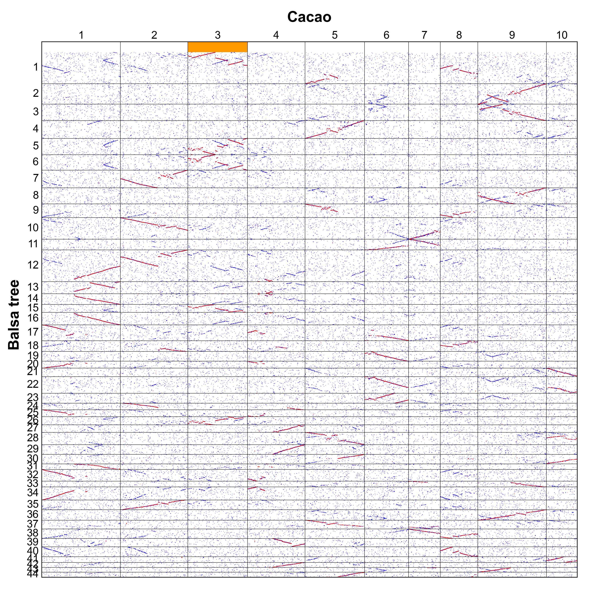

Next, we use WGDI with the '-icl' and '-bi' parameters to find and integrate collinear genes between them. This allows us to easily screen for collinear fragments. We then set parameters (multiple = 1, homo = 0.5, 1) to extract synteny blocks, which are mostly composed of red dots, from the comparison of the balsa tree and cacao using WGDI with the '-c' parameter. We then use WGDI with the '-bk' parameter to examine whether the filtered synteny blocks are reasonable. Since we haven’t calculated the Ks values, they are all defaulted to -1. This step is absolutely crucial because it ensures that the balsa tree's chromosomes correspond to the unique homologous region of cacao. The filtered results are shown in the figure below.

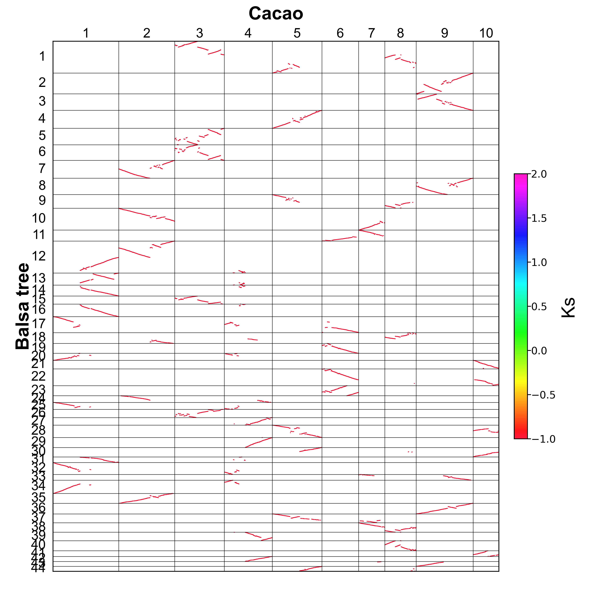

Finally, we use the '-km' parameter of WGDI to extract the mapping of cacao colors to the balsa tree, resulting in the ancestor_file of the balsa tree, namely opy300s.ancestor.txt. We then generate a dot plot using the '-d' parameter in WGDI, specifying ‘ancestor_left = opy300s.ancestor.txt’. The resulting dot plot is shown in the figure below.

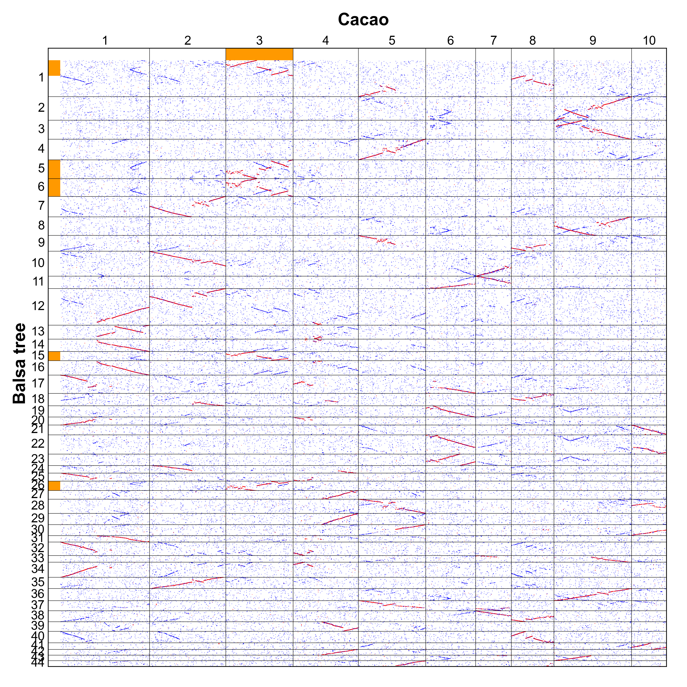

Omitting the chromosomes marked as white, the remaining  chromosomes are as follows.

 [opy300s.ancestor.txt](./phase_subgenomes/figure/opy300s.ancestor.txt) 

| 1    | 1    | 1375 | #ff9900 | 1    |
| ---- | ---- | ---- | ------- | ---- |
| 15   | 1    | 807  | #ff9900 | 1    |
| 26   | 1    | 829  | #ff9900 | 1    |
| 5    | 1    | 1655 | #ff9900 | 1    |
| 6    | 1    | 1585 | #ff9900 | 1    |

We assign all balsa chromosome blocks to one of five subgenomes based on chromosome complementarity. These five chromosomes independently correspond to Chr3 of cacao, indicating that they have not undergone any fusion or fission events. As a result, they can be directly phased into five distinct subgenomes. The last column of ancestor_file represents different subgenomes.

[opy300s.ancestor.new.txt](./phase_subgenomes/figure/opy300s.ancestor.new.txt) 

| 1    | 1    | 1375 | #ff9900 | 1    |
| ---- | ---- | ---- | ------- | ---- |
| 15   | 1    | 807  | #ff9900 | 2    |
| 26   | 1    | 829  | #ff9900 | 3    |
| 5    | 1    | 1655 | #ff9900 | 4    |
| 6    | 1    | 1585 | #ff9900 | 5    |

[opy300s.ancestor.txt](./phase_subgenomes/figure/opy300s.ancestor.txt) 

We record the subgenome regions on the chromosomes and use WGDI with the parameters '-pc' and '-a' to obtain hierarchical gene lists. The resulting dot plot is shown in the figure below.

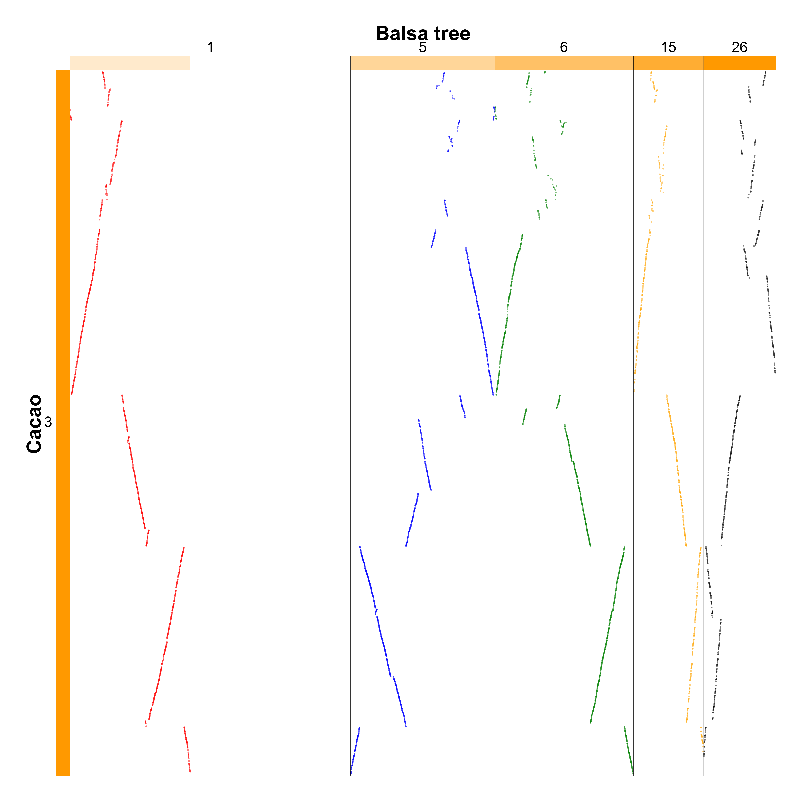

The hierarchical gene lists : [tc180s_opy300s.alignment.csv](./phase_subgenomes/figure/tc180s_opy300s.alignment.csv) 

| tc180s3g00001 |                |                |                |                 |                 |
| ------------- | -------------- | -------------- | -------------- | --------------- | --------------- |
| tc180s3g00002 |                |                |                |                 |                 |
| tc180s3g00003 |                |                |                |                 |                 |
| tc180s3g00004 |                |                |                |                 |                 |
| tc180s3g00005 |                |                | opy300s6g00577 |                 | opy300s26g00710 |
| tc180s3g00006 | opy300s1g00373 |                | opy300s6g00576 | opy300s15g00208 | opy300s26g00709 |
| tc180s3g00007 | opy300s1g00374 |                | opy300s6g00574 | opy300s15g00207 | .               |
| tc180s3g00008 | opy300s1g00375 |                | opy300s6g00568 | .               | .               |
| tc180s3g00009 | opy300s1g00376 | opy300s5g01075 | opy300s6g00567 | opy300s15g00206 | opy300s26g00708 |
| tc180s3g00010 | opy300s1g00377 | opy300s5g01074 | opy300s6g00393 | .               | opy300s26g00707 |
| tc180s3g00011 | opy300s1g00379 | opy300s5g01073 | .              | .               | .               |
| tc180s3g00012 | .              | opy300s5g01072 | .              | opy300s15g00205 | .               |
| ...           | ...            | ...            | ...            | ...             | ...             |

###### Phased subgenomes for Heritiera littoralis. 

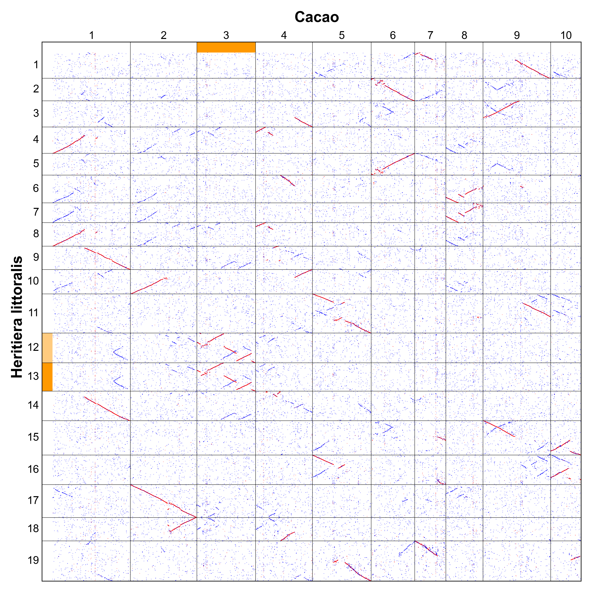

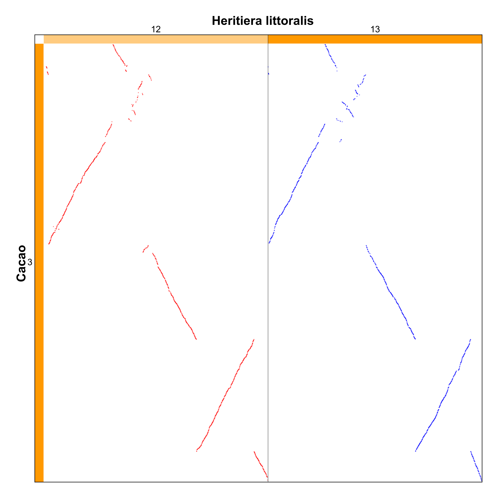

[tc180s_hli2s.alignment.csv](./phase_subgenomes/figure/tc180s_hli2s.alignment.csv) 

| tc180s3g00001 |               |               |
| ------------- | ------------- | ------------- |
| tc180s3g00002 |               |               |
| tc180s3g00003 |               |               |
| tc180s3g00004 |               |               |
| tc180s3g00005 |               | hli2s13g00417 |
| tc180s3g00006 | hli2s12g00507 | hli2s13g00418 |
| tc180s3g00007 | hli2s12g00508 | hli2s13g00420 |
| tc180s3g00008 | .             | .             |
| tc180s3g00009 | hli2s12g00510 | .             |
| tc180s3g00010 | hli2s12g00511 | .             |
| tc180s3g00011 | .             | .             |
| tc180s3g00012 | hli2s12g00512 | hli2s13g00422 |
| ...           | ...           | ...           |

###### Phased subgenomes for durian.

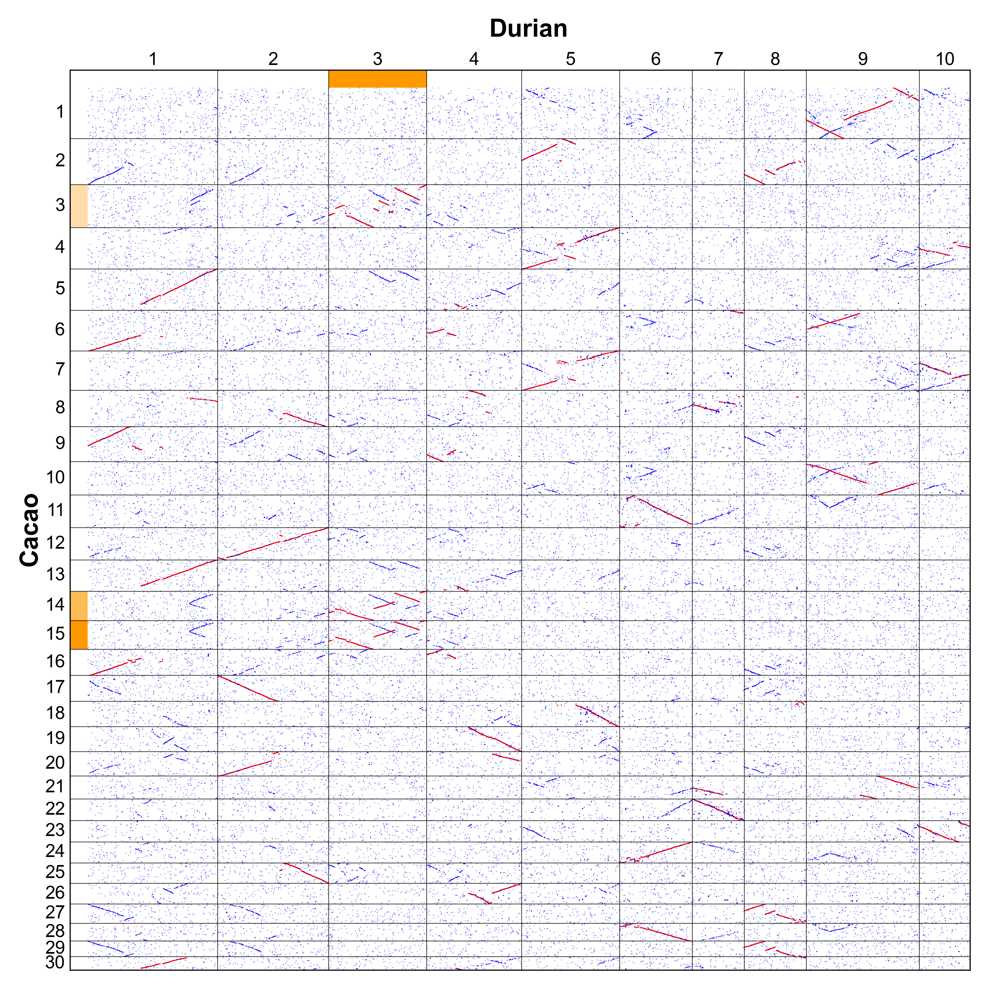

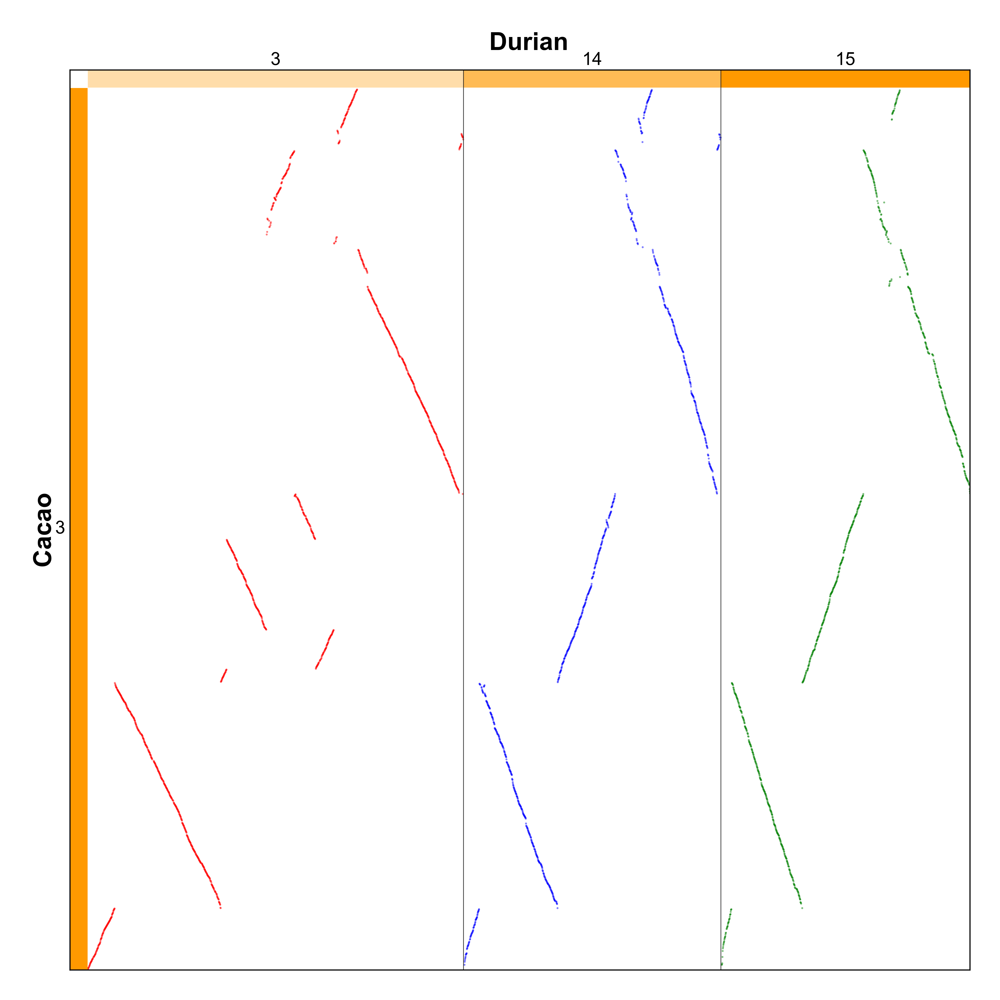

[tc180s_dz186s.alignment.csv](./phase_subgenomes/figure/tc180s_dz186s.alignment.csv) 

| tc180s3g00001 |               |                |                |
| ------------- | ------------- | -------------- | -------------- |
| tc180s3g00002 |               |                |                |
| tc180s3g00003 |               |                |                |
| tc180s3g00004 |               |                |                |
| tc180s3g00005 | dz186s3g01240 |                |                |
| tc180s3g00006 | dz186s3g01239 | dz186s14g00867 |                |
| tc180s3g00007 | dz186s3g01238 | .              | dz186s15g00824 |
| tc180s3g00008 | .             | dz186s14g00866 | .              |
| tc180s3g00009 | dz186s3g01236 | dz186s14g00865 | dz186s15g00823 |
| tc180s3g00010 | dz186s3g01235 | dz186s14g00864 | .              |
| tc180s3g00011 | dz186s3g01234 | .              | .              |
| tc180s3g00012 | dz186s3g01233 | dz186s14g00863 | dz186s15g00822 |
| ...           | ...           | ...            | ...            |

##### Relationships among the subfamilies

Let’s discuss how we can infer relationships among the subfamilies from collinear genes.

First, we combine the subgenomes of different species into a single file. Since cacao serves as the reference for all of them, we can directly paste them into a file. Column 1 is from cacao, Columns 2 and 3 are from heritiera littoralis, Columns 4, 5, and 6 are from durian, and Columns 7, 8, 9, 10, and 11 are from the balsa tree.

| tc180s3g00001 |               |               |               |                |                |                |                |                |                 |                 |
| ------------- | ------------- | ------------- | ------------- | -------------- | -------------- | -------------- | -------------- | -------------- | --------------- | --------------- |
| tc180s3g00002 |               |               |               |                |                |                |                |                |                 |                 |
| tc180s3g00003 |               |               |               |                |                |                |                |                |                 |                 |
| tc180s3g00004 |               |               |               |                |                |                |                |                |                 |                 |
| tc180s3g00005 |               | hli2s13g00417 | dz186s3g01240 |                |                |                |                | opy300s6g00577 |                 | opy300s26g00710 |
| tc180s3g00006 | hli2s12g00507 | hli2s13g00418 | dz186s3g01239 | dz186s14g00867 |                | opy300s1g00373 |                | opy300s6g00576 | opy300s15g00208 | opy300s26g00709 |
| tc180s3g00007 | hli2s12g00508 | hli2s13g00420 | dz186s3g01238 | .              | dz186s15g00824 | opy300s1g00374 |                | opy300s6g00574 | opy300s15g00207 | .               |
| tc180s3g00008 | .             | .             | .             | dz186s14g00866 | .              | opy300s1g00375 |                | opy300s6g00568 | .               | .               |
| tc180s3g00009 | hli2s12g00510 | .             | dz186s3g01236 | dz186s14g00865 | dz186s15g00823 | opy300s1g00376 | opy300s5g01075 | opy300s6g00567 | opy300s15g00206 | opy300s26g00708 |
| tc180s3g00010 | hli2s12g00511 | .             | dz186s3g01235 | dz186s14g00864 | .              | opy300s1g00377 | opy300s5g01074 | opy300s6g00393 | .               | opy300s26g00707 |
| tc180s3g00011 | .             | .             | dz186s3g01234 | .              | .              | opy300s1g00379 | opy300s5g01073 | .              | .               | .               |
| tc180s3g00012 | hli2s12g00512 | hli2s13g00422 | dz186s3g01233 | dz186s14g00863 | dz186s15g00822 | .              | opy300s5g01072 | .              | opy300s15g00205 | .               |
| tc180s3g00013 | hli2s12g00513 | .             | .             | .              | dz186s15g00821 | .              | opy300s5g01071 | .              | .               | .               |

Next, using the hierarchical gene lists, we infer maximum likelihood (ML) trees using IQ-TREE through WGDI with the parameter '-at'. We then use ASTRAL-III v.5.7.8 with the parameter ‘-t 16’ to construct the coalescent tree and estimate branch support.

The collinear gene trees are [tc_hli_dz_opy.nwk](./phase_subgenomes/figure/figure/tc_hli_dz_opy.nwk) and the coalescent tree is [tc_hli_dz_opy.tre](./phase_subgenomes/figure/figure/tc_hli_dz_opy.tre) 

We can rearrange the initial arbitrary arrangement of phase subgenomes that differentiates species. By adjusting the order of phase subgenomes within the same species, we find that phase subgenomes S1 and S2 for Heritiera littoralis, durian, and balsa tree form separate clusters. Similarly, phase subgenomes S1, S2, and S3 for durian and balsa tree also form separate clusters.

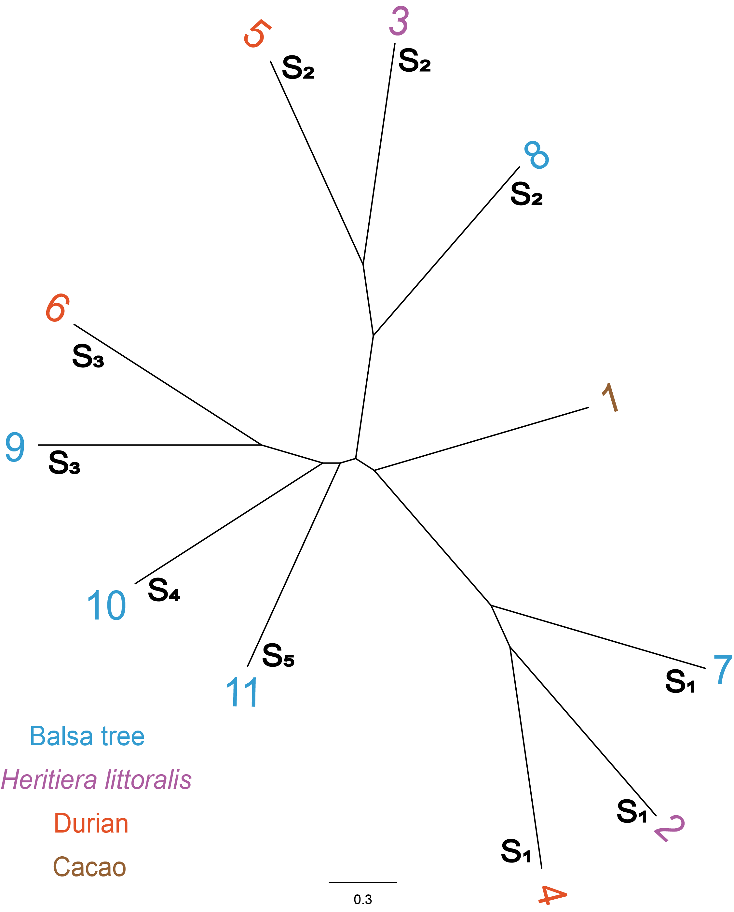

Finally, we adjust the order of the subgenomes in the ancestor_file. For instance, the phased subgenomes for the balsa tree are updated accordingly. 

| 1    | 1    | 1375 | #ff9900 | 3    |
| ---- | ---- | ---- | ------- | ---- |
| 15   | 1    | 807  | #ff9900 | 4    |
| 26   | 1    | 829  | #ff9900 | 5    |
| 5    | 1    | 1655 | #ff9900 | 1    |
| 6    | 1    | 1585 | #ff9900 | 2    |

We continue to use WGDI with the parameters '-pc' and '-a' to obtain new hierarchical gene lists.

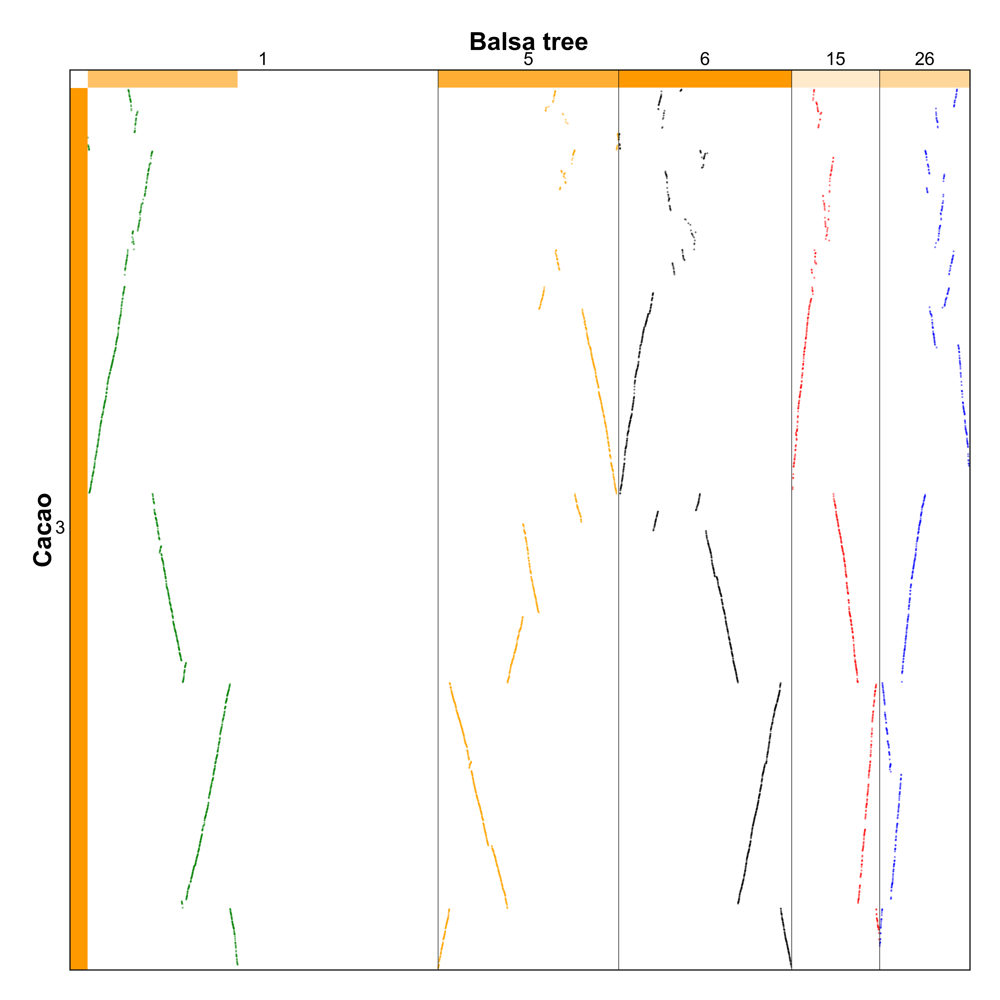

###### Phased subgenomes for cotton.

We used the WGDI toolkit  with the parameter '-d' to plot homologous gene dot plot between balsa tree and cacao. The mapping of cacao's Chr3 to cotton chromosomes is dispersed, making it difficult to partition directly as before. In this case, we can use complementary combinations between synteny blocks to determine the phase of different subgenomes. Specifically, blocks from cotton Chrs 12 and 13 correspond intact to cacao's Chr3 and can be considered separate subgenomes, each marked with a different color. The blocks from Cotton Chrs 7 and 8 complement Chr3 of cacao and form another subgenome. cotton Chrs 1 and 3 are complementary, and the upper region of cotton Chr9 aligns perfectly with the remaining blocks, making them another subgenome. The remaining blocks of cotton Chr9 constitute yet another subgenome. This way, we phased these blocks into five subgenomes and grouped them randomly.

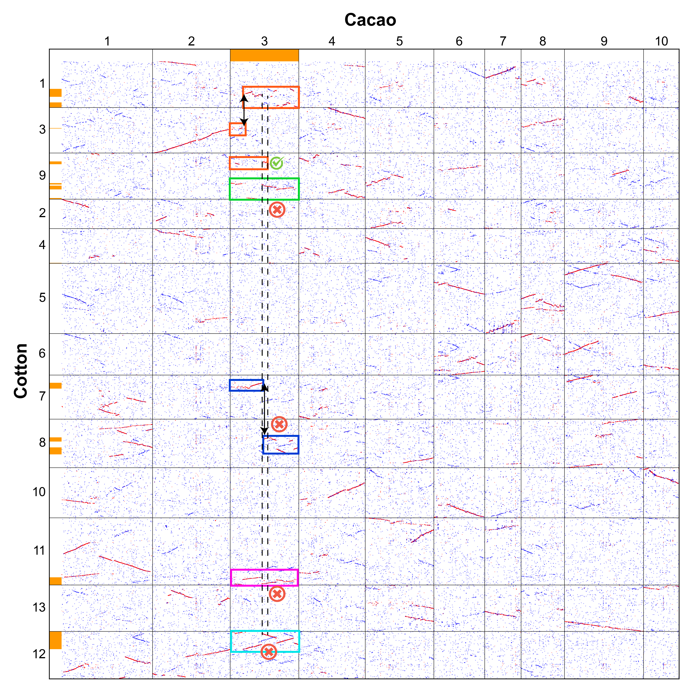

| 1    | 1691 | 2175 | #ff9900 | 1    |
| ---- | ---- | ---- | ------- | ---- |
| 1    | 2530 | 2841 | #ff9900 | 1    |
| 3    | 1256 | 1292 | #ff9900 | 1    |
| 4    | 2106 | 2145 | #ff9900 | 1    |
| 9    | 518  | 686  | #ff9900 | 1    |
| 7    | 475  | 828  | #ff9900 | 2    |
| 8    | 1112 | 1370 | #ff9900 | 2    |
| 8    | 1740 | 2165 | #ff9900 | 2    |
| 9    | 1846 | 1936 | #ff9900 | 3    |
| 9    | 2008 | 2236 | #ff9900 | 3    |
| 9    | 2763 | 2840 | #ff9900 | 3    |
| 11   | 3659 | 4131 | #ff9900 | 4    |
| 12   | 1    | 1101 | #ff9900 | 5    |

We continue to use WGDI with the parameters '-pc' and '-a' to obtain hierarchical gene lists.

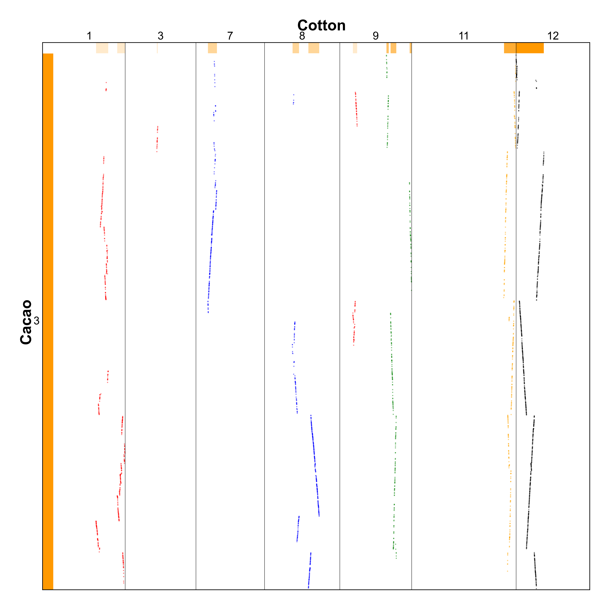

As we've previously categorized the balsa tree into five subgenomes, we combined these subgenomes with those of cotton into a single file. Column 1 is from cacao, Columns 2, 3, 4, 5, and 6 are from the balsa tree, Columns 7, 8, 9, 10, and 11 are from cotton. We then used WGDI with the '-at' parameter and ASTRAL-III version 5.7.8 to infer relationships among the subfamilies.

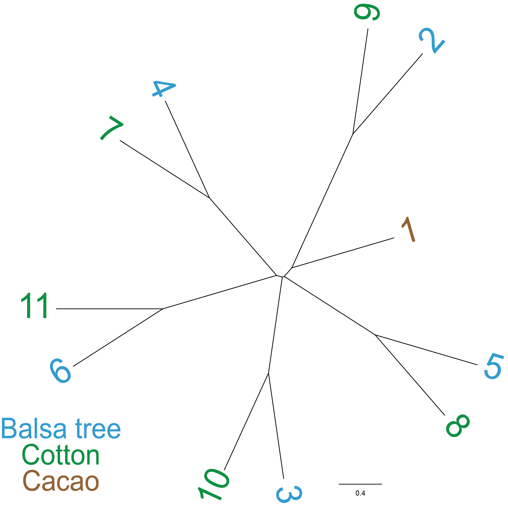

By rearranging the order of phased subgenomes in cotton, we observed a one-to-one relationship between the five subgenomes of the balsa tree and cotton.

| 1    | 1691 | 2175 | #ff9900 | 3    |
| ---- | ---- | ---- | ------- | ---- |
| 1    | 2530 | 2841 | #ff9900 | 3    |
| 3    | 1256 | 1292 | #ff9900 | 3    |
| 4    | 2106 | 2145 | #ff9900 | 3    |
| 9    | 518  | 686  | #ff9900 | 3    |
| 7    | 475  | 828  | #ff9900 | 4    |
| 8    | 1112 | 1370 | #ff9900 | 4    |
| 8    | 1740 | 2165 | #ff9900 | 4    |
| 9    | 1846 | 1936 | #ff9900 | 1    |
| 9    | 2008 | 2236 | #ff9900 | 1    |
| 9    | 2763 | 2840 | #ff9900 | 1    |
| 11   | 3659 | 4131 | #ff9900 | 2    |
| 12   | 1    | 1101 | #ff9900 | 5    |

Additionally, we can quickly phase subgenomes based on the sequence similarity between the balsa tree and cotton. Because red dots represent high sequence similarity, synteny blocks with more red dots are assigned to their corresponding subgenomes. Importantly, both methods yielded consistent results.

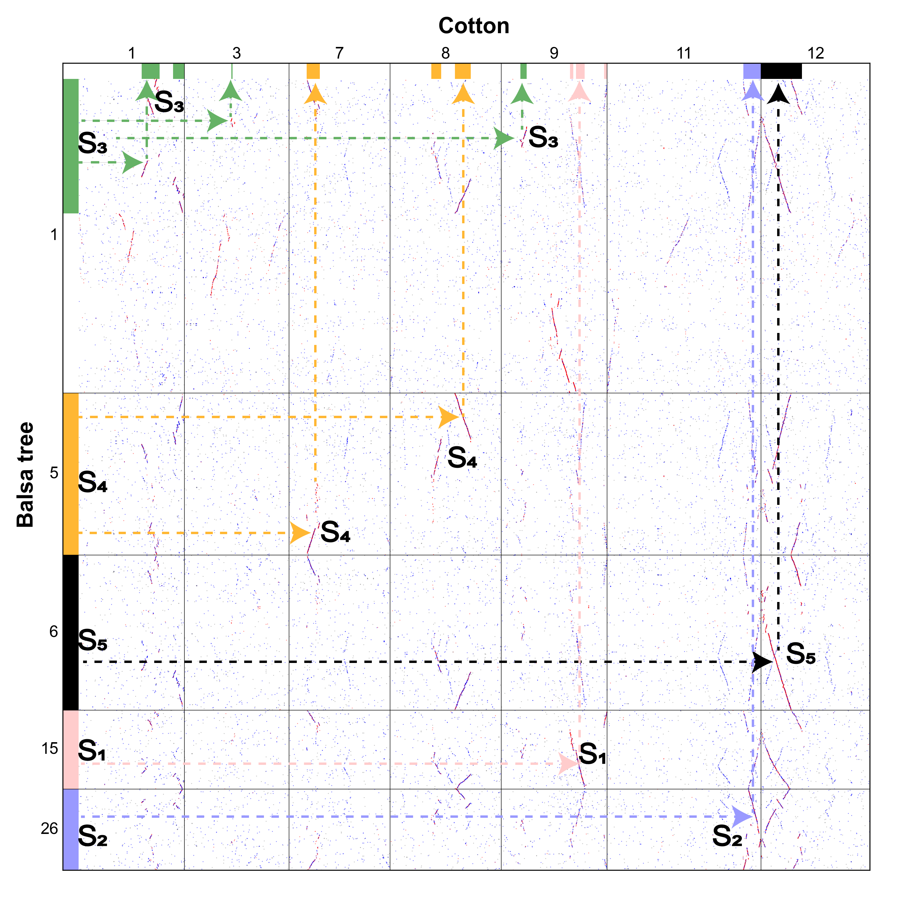

Furthermore, subgenomes could also be phased based on additional information, such as Ks values, structural consistency, and the number of retained genes. Regardless of the method employed for subgenome phasing, we ultimately validated the results using colinear gene trees.

We merged all the corrected hierarchical gene lists and subsequently reconstructed a consensus tree using WGDI with the '-at' parameter and ASTRAL-III version 5.7.8.

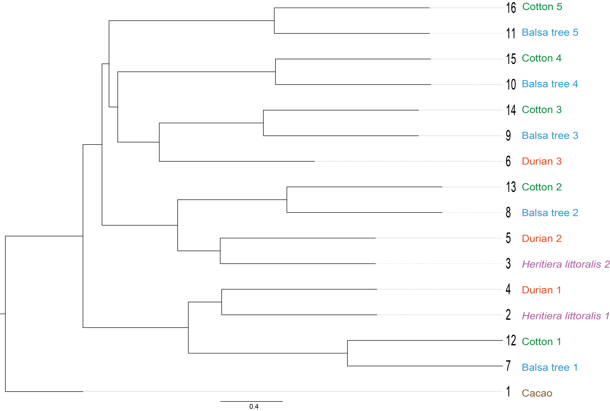